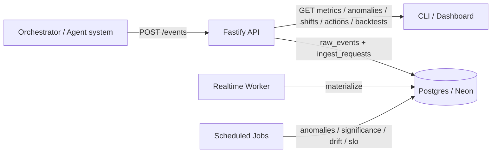

## Eval Service — Module 3 Evaluation Framework (Real-Time + Long-Term)

TypeScript/Node.js service that ingests orchestration/agent telemetry and produces **real-time quality monitoring**, **statistical change detection**, **long-term backtests**, and an **auto-evaluation loop** (drift → recommended actions).

If you’re reviewing the challenge submission, start here: `SUBMISSION_MODULE3.md`.

---

## What you can demo (end-to-end)

- **Ingest** structured events (`POST /events`) with JSON Schema validation + idempotency
- **Compute** per-run evaluation records (normalized metrics + aggregate scores)
- **Detect anomalies** (MAD / z-score + hard rules like hallucination flag)
- **Detect shifts** (Welch’s t-test with Student‑t p-values + Benjamini–Hochberg correction)
- **Detect drift → actions** (PSI/Wasserstein → `recommended_actions`)
- **Backtest signals** with point-in-time datasets (IC, Sharpe, hit rate)

---

## Architecture

### High-level diagram



### Data flow (what happens when you POST events)

- **API (`src/api`)**
  - Validates events via AJV schemas (`src/contracts/v1/*`)
  - Enforces idempotency via `ingest_requests`
  - Writes raw events to `raw_events`
  - Invalid events go to `dead_letter_events`
- **Realtime worker (`src/workers/realtimeWorker.ts`)**
  - Consumes `raw_events`
  - Materializes into:
    - `orchestration_runs`, `agent_runs`
    - `evaluation_records` (latency/faithfulness/coverage/confidence/hallucination + aggregate scores)
    - `signals` / `market_outcomes` (when those event types exist)
- **Jobs**
  - `job:anomalies`: writes to `anomalies` + flags `evaluation_records.anomaly_flag`
  - `job:significance`: writes to `performance_shifts` (Welch t-test + BH)
  - `job:auto-eval`: writes to `recommended_actions` (drift detection)
  - `job:slo-alerts`: creates actions on SLO breaches (if configured)
- **Query API**
  - `GET /metrics/*`, `/anomalies`, `/shifts`, `/actions/recommended`, `/backtests`

---

## Quickstart (copy/paste-safe)

### 1) Install + configure

```bash
cd eval-service
npm install
cp env.example .env.local
```

Set `DATABASE_URL` in `.env.local` (Neon Postgres is supported; SSL is auto-detected for `neon.tech` / `sslmode=require`).

### 2) Migrate

```bash
cd eval-service
npm run db:migrate
```

### 3) Start the API + worker (two terminals)

**Terminal A**

```bash
cd eval-service
npm run dev
```

**Terminal B**

```bash
cd eval-service
npm run worker:realtime
```

### 4) Seed + run jobs (third terminal)

```bash
cd eval-service
DATASET_VERSION=pit_demo_final INJECT_ANOMALY=true npm run seed:demo
LOOKBACK_HOURS=72 npm run job:anomalies
SIGNIFICANCE_METRIC=faithfulness_score WINDOW_HOURS=1 npm run job:significance
BASELINE_HOURS=4 CURRENT_HOURS=1 npm run job:auto-eval
DATASET_VERSION=pit_demo_final HORIZON=1d npm run backtest:run
```

### 5) Verify via HTTP

```bash
curl -sS 'http://127.0.0.1:3001/metrics/agents?limit=10'
curl -sS 'http://127.0.0.1:3001/anomalies?limit=10'
curl -sS 'http://127.0.0.1:3001/shifts?limit=10'
curl -sS 'http://127.0.0.1:3001/actions/recommended?status=open&limit=20'
curl -sS 'http://127.0.0.1:3001/backtests?limit=5'
```

---

## Demo agent emitter (optional, “not only synthetic”)

You can emit a real agent run through the same ingestion contract:

```bash
cd eval-service
npm run demo:agent
```

- If `OPENAI_API_KEY` is set, it will call OpenAI and ingest the run.
- If not, it uses a stubbed response (still proves contract + pipeline).

---

## Scripts

```text
dev               Start Fastify API (tsx watch)
worker:realtime   Process raw_events → materialized tables
db:migrate        Run SQL migrations
seed:demo         Generate synthetic dataset (signals + outcomes + anomalies)
demo:agent        Emit a live run (optional OpenAI)
job:anomalies     Outlier detection → anomalies table
job:significance  Welch t-test + BH → performance_shifts
job:auto-eval     Drift detection → recommended_actions
job:slo-alerts    SLO checks → actions (optional)
backtest:run      Backtest signals vs outcomes → backtest_runs
```

---

## Key tables (what to look at)

- **Execution**
  - `orchestration_runs`, `agent_runs`
- **Real-time evaluation**
  - `evaluation_records`, `metric_rollups_hourly`, `anomalies`
- **Long-term evaluation**
  - `signals`, `market_outcomes`, `signal_outcomes`, `backtest_runs`
- **Auto-eval**
  - `performance_shifts`, `recommended_actions`
- **Safety / ops**
  - `ingest_requests`, `dead_letter_events`

---

## Configuration

### Environment variables

- **`DATABASE_URL` (required)**: Postgres connection string
- **`PORT`**: API port (default `3001`)
- **`EVAL_API_KEY`**: if set, require `X-API-Key` on requests
- **`OPENAI_API_KEY`**: enable real LLM calls in `demo:agent`
- **`PG_SSL`**: set `true` to force SSL (usually not needed for Neon)
- **`OTLP_ENDPOINT`**: OpenTelemetry collector endpoint (optional)

---

## Deployment notes (production)

- Run **two processes**:
  - API: `npm run build && npm run start`
  - Worker: `npm run worker:realtime` (or a compiled worker entry if you add one)
- Run jobs via a scheduler (cron / GitHub Actions / Cloud scheduler):
  - `job:anomalies`, `job:significance`, `job:auto-eval`, `job:slo-alerts`

---

## Troubleshooting

- **`TypeError: fetch failed (ECONNREFUSED)` during `seed:demo`**
  - Start the API first (`npm run dev`). The seed script retries, but it still needs the API process running.
- **Zsh says `command not found: #`**
  - Don’t paste comment lines, or run: `setopt interactivecomments`


